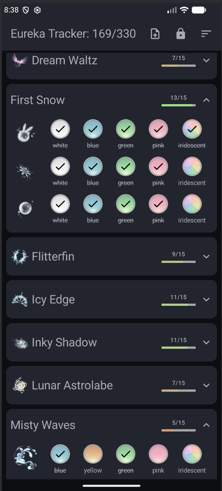

# INHelper
A simple android app to help track obtained eurekas colors in the game Infinity Nikki.

### Features
---
- Sort list - Alphabetically or by Eureka colors obtained 
- Lock button to prevent accidental changes
- Import `.csv` file to auto fill existing data for users already using [slashie's infinity nikki sheet](https://docs.google.com/spreadsheets/d/1Ak0ezNY42eLiKwCsbqOmSxLYlbSGYAP9W2umM_v9rP4/edit?gid=1116526076#gid=1116526076) - Eureka Colors sheet

### How to import csv file
1. Export the Eureka Colors google sheet as a `.csv` file
> **From Desktop**: 
> - `File` > `Download` > `Comma-Separated Values (.csv)`
> - Transfer file to mobile device (email, usb, etc.)
>
> **On Mobile**
> - In the Google Sheets app: Menu (3 dots) > `Share and export` > `Save as` > `CSV (current sheet)` > Upload the csv file to Drive
> - Download the file, file should be located in Downloads folder.

2. In app, click on the Import button and select the csv file to use. 